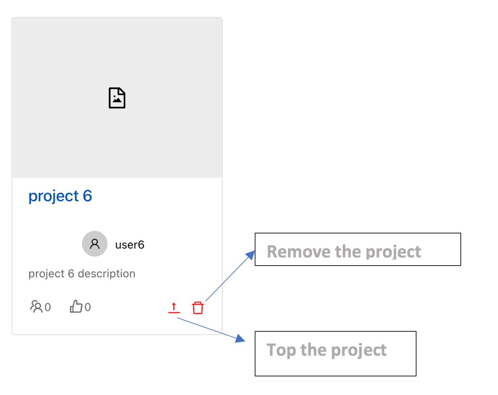
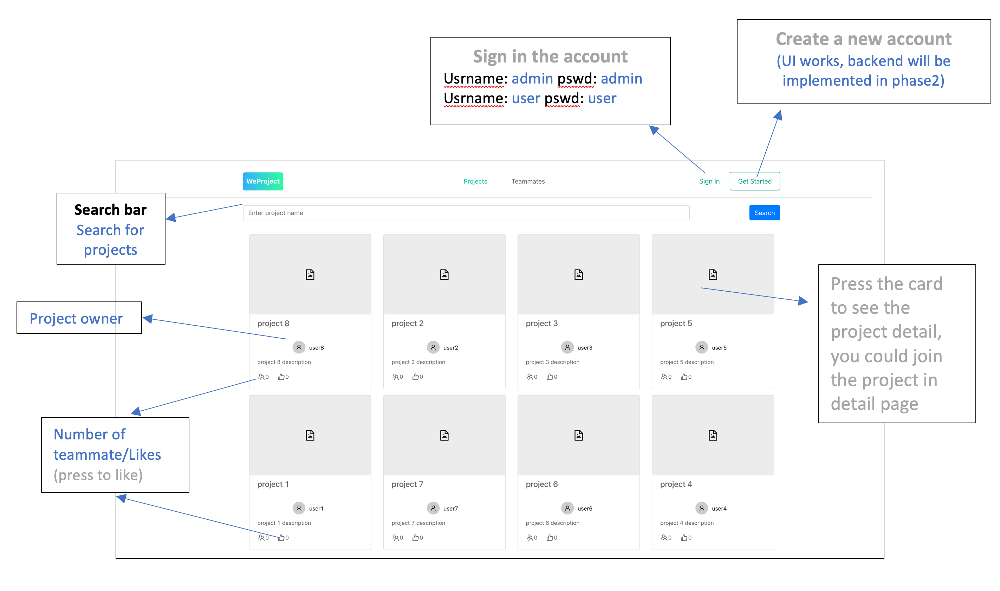
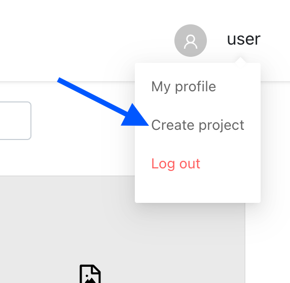
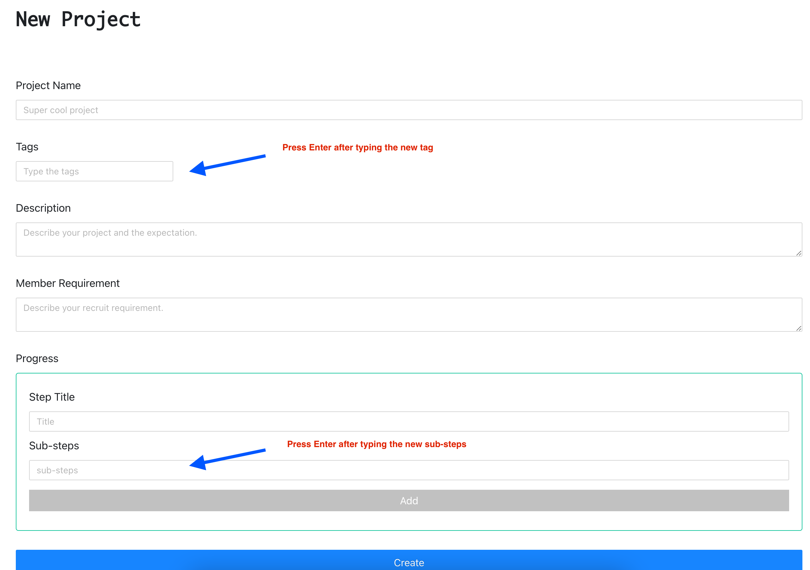
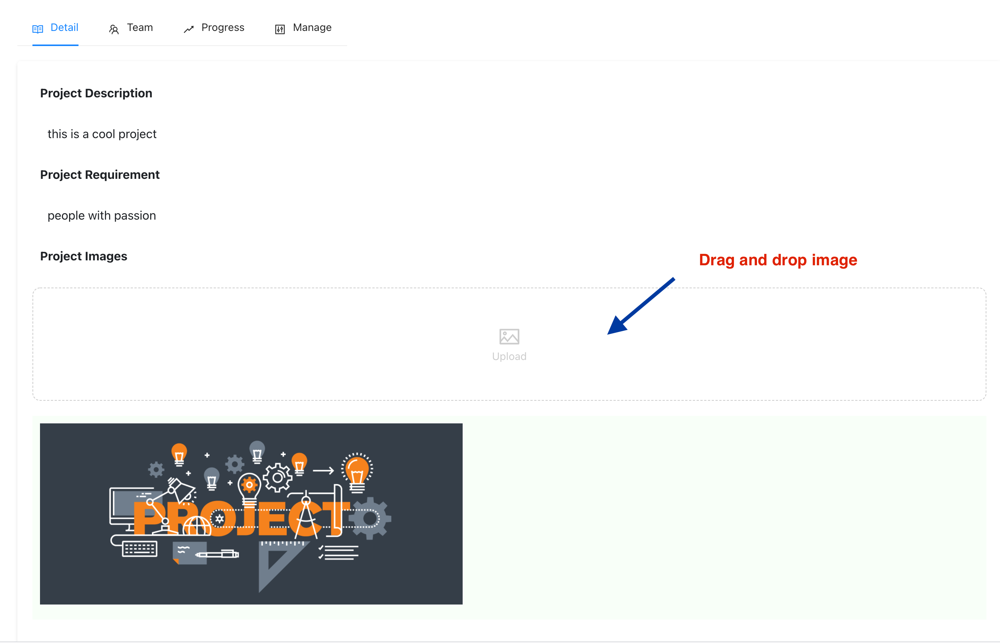
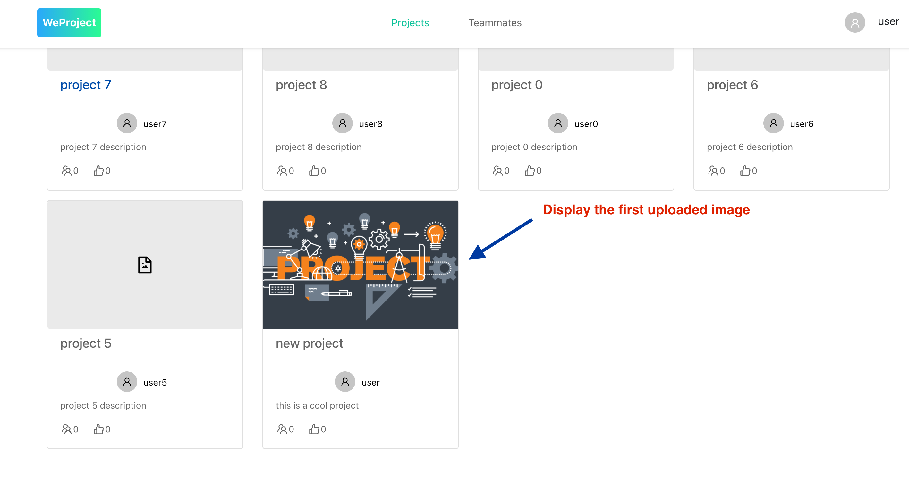
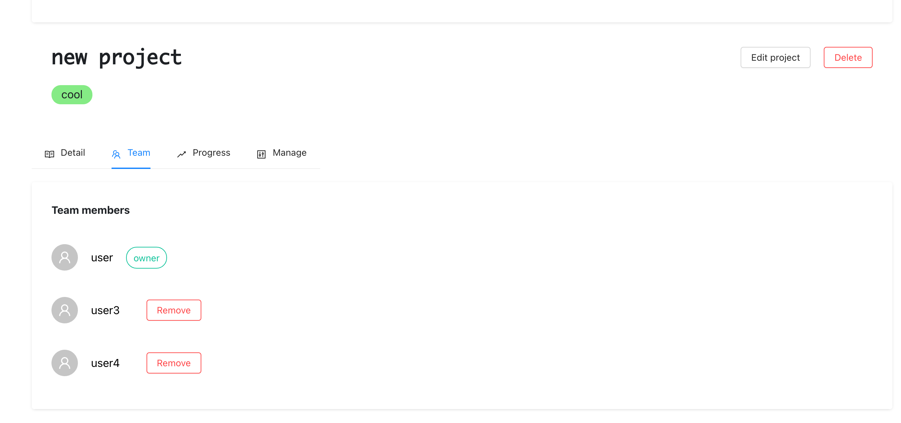
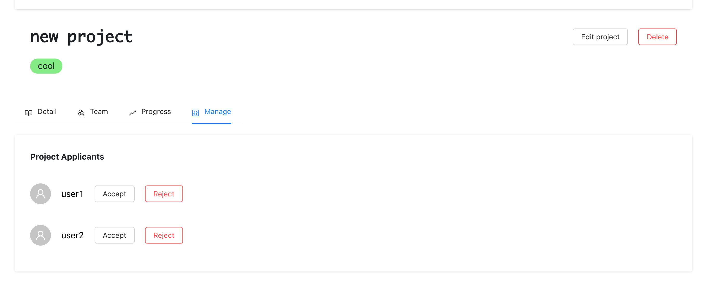
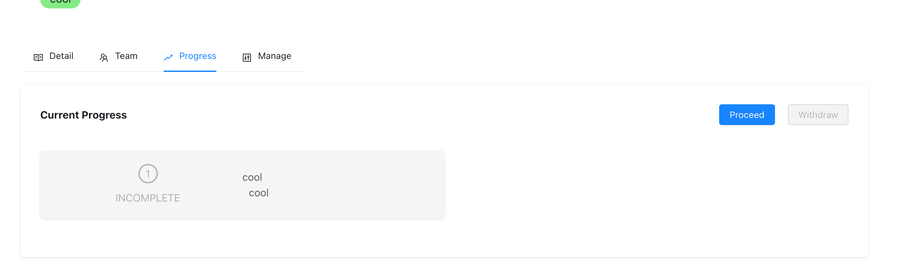

# App Name: WeProject

## How to start
- Install all the dependencies: `npm run setup`
- Build and run at the localhost PORT=5000: `npm run build-run`
- Login Credential `username:password`
    - user: `user:user`
    - admin: `admin:admin`

## Deployed Website Link

http://we-project.herokuapp.com/

## Third party libraries:
- React
- React Router Dom
- React uuid (creating unique id for new objects)
- react-dropzone (image upload)
- Ant Design (Avatar, Icons)
- React Bootstrap (SimpleCard, SimpleList)

## Current Features
- Header
    - Router
    - User logour
- Login
    - Sign In/Sign up
    - Login as admin
- Project Browsing
    - title
    - owner avatar, username
    - description
    - number of views/team membesr/likes
- Teammate Browsing
    - User info
    - Connect with users
- Project Details
- Teammate Details
- Admin Previliges (In progress)

## Server Routes

### User Routes

- GET "/api/user/:username"
- GET "/api/users"
- POST "/api/newUser"
- DELETE "/api/deleteUser/:username"
- PATCH "/api/updateProfile"
- PATCH "/connections/reply/:username"
- POST "/connections/request/:username"
- DELETE "/connections/remove/:username"

## User Cases
- **project browsing** page (see the pricture below for detailed reference)
  - search bar: you could search project by name
  - project card: detailed info about the project, you could press the card to see the detail.

  - admin functionality of the page: 

    - stick/unstick a specific project to the top
    - delete a project 

 
  
  - **Teammate Browsing** page
    - similar layout, admin functionality. See project browsing page for reference.
  
  - **User Profile** page
 
    - After logging in, access the profile page through 'My profile' tab on the upper right corner
    

    - Click 'Edit Profile' button to change profile information: self introduction, add/remove skills, update social media information, add/remove experiences, etc.
      
    
      
   
      
    
    - Click on 'Save Changes' button to save changes
      
    
      
    
  - **User Detail** page
    - After logging in, access user detail page by clicking on the card in the teammate browsing page
    - Similar to profile page, but there is no 'Edit Profile' button
    - If logged in as admin, there will be a delete button, which will remove the user permanently.
   
    

  - **Create Project**
    - click the `creat new project` under the user avatar

    

    - fill all the fields in the `create project page`, and then press `CREATE`

    

  - **Project Detail**
    - owner can upload project image by "drag and drop"

    
    

    - owner can remove members or applicants under `Team` or `Manage` tab

    
    

    - owner can also manage the progress with `proceed` or `withdral`

    
    

